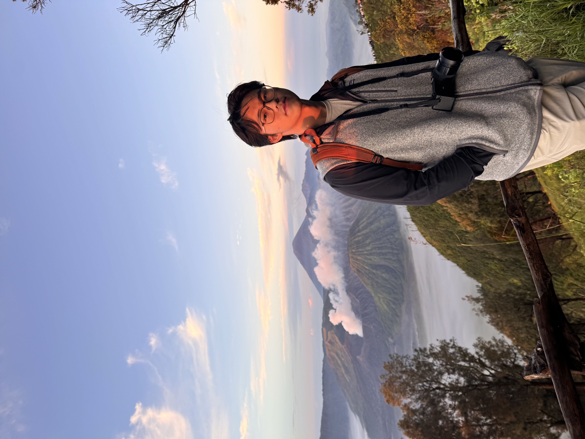
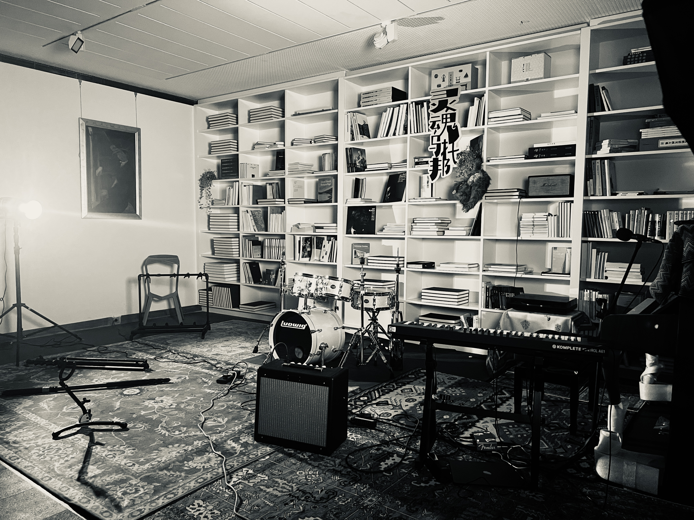
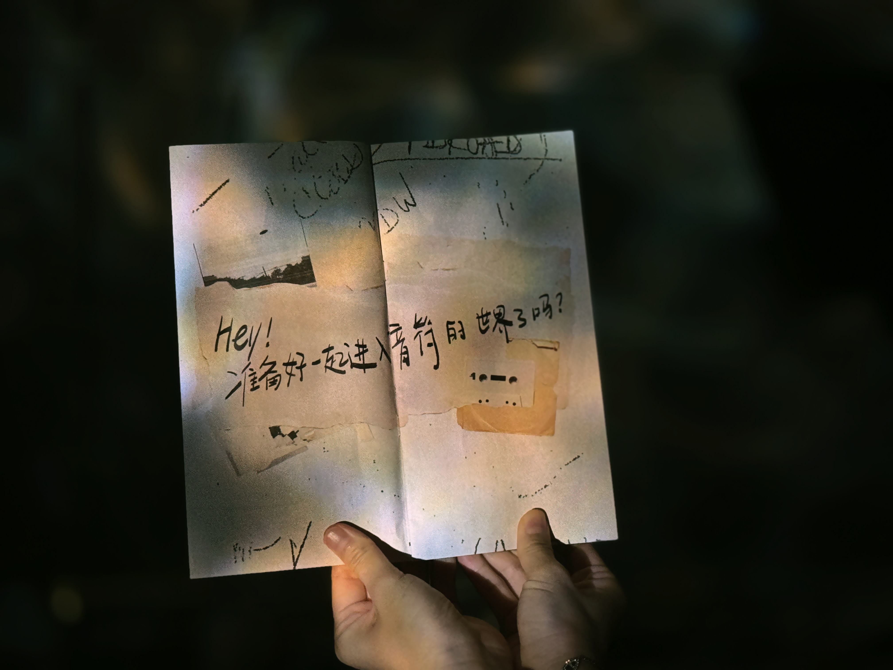

  

# 加州大学伯克利分校 · 音乐作曲系（2025秋季入学）  
📍 广州 | 📧 kun.liu0428@outlook.com  
🎵 [SoundCloud/作品集] | 🌐 [SoulTopia官网：http://euphorians.org/ ]

- 作曲 / 编曲｜影视配乐｜电子音乐制作｜艺术活动策展  
- 乐器演奏：主修爵士吉他，兼修钢琴与次中音萨克斯  
- 语言能力：英语（流利）｜普通话（母语）｜法语（熟练）

---

## 核心优势 Core Strengths（专业能力）

- 就读于**加州大学伯克利分校（UC Berkeley）音乐系**，专攻**作曲与影视配乐方向**
- 国际文凭（IB）音乐高级课程（HL）获满分 7 分
- 代表性研究方向：
  - 德彪西印象派音乐与爵士即兴之间的和声融合研究  
  - 拉丁爵士节奏在现代电影配乐中的叙事功能应用

- 电子音乐技术：
  - 精通 **Logic Pro** 专业音频工作站  
  - 熟练运用 **Cubase、SerumFX、ValhallaDSP、iZotope** 等音效插件与效果链设计
- 音乐风格与擅长方向：
  - 🎷 **爵士（Jazz）**：精通大乐队（Big Band）编制与和声创作，灵感来源包括 Miles Davis、Duke Ellington、Pat Metheny 等  
  - 🎬 **影视配乐（Film Scoring）**：融合 Hans Zimmer 式的叙事结构与音效塑造  
  - 🌏 **世界音乐（World Music）**：探索中国民族乐器（如二胡）与爵士及电子音乐的跨界融合

---

## 艺术策展与组织能力 Art Leadership & Planning

- **SoulTopia 爵士节 创始人兼总策划人**  
  独立组织广州地区非营利性爵士音乐会（观众超200人），联动5家艺术机构/画廊，线上传播覆盖超7万人次  

- **Tri-M 国际音乐荣誉学会 副主席**（两届）  
  主导校园音乐普及计划，累计志愿服务时长达200小时+

- **茱莉亚音乐学院 × Global Campus 全球大使**  
  协作策划三场国际跨校艺术工作坊，覆盖学生人数300+，推动音乐文化跨国交流
  
  策划“古典作品爵士化”主题演出，如德彪西《月光》改编呈现

---

## 代表性项目 Representative Projects（项目经验）

### 🎬 影视/多媒体配乐  
- 《**Wings**》原创动画短片配乐重制（2025）  
- 香港 **La Vene Studio** 纪录片原声配乐制作（2024）

### 🎵 原创音乐实验  
- 《**Keep Countin'**》——灵感来自《爱乐之城》作曲家 Justin Hurwitz 的钢琴风格  
- 柴可夫斯基《**天鹅湖**》改编为爵士三重奏版本

### 🔊 声音设计与音效创新  
- 自研 **东亚战鼓音色库**（用于紧张情绪场景的电影配乐）  
- 结合 **AI音乐工具（如Sonos）** 进行和声生成与手动改编实验，提升作曲效率

### 🤝 合作网络  
- **YoungProduce 青年影像平台**（纪录片配乐制作）  
- 香港 **La Vene Studio** 跨地合作音乐人、剪辑师团队

